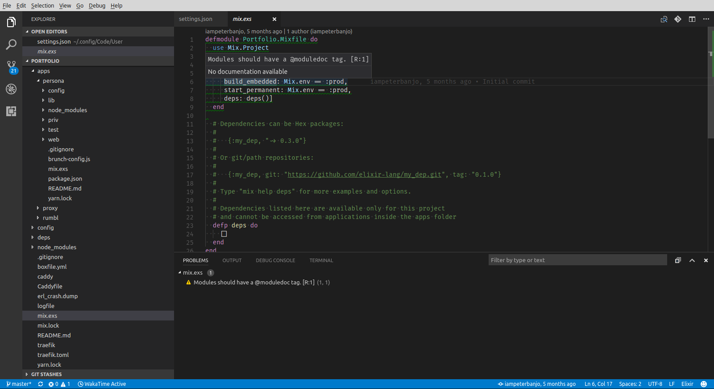
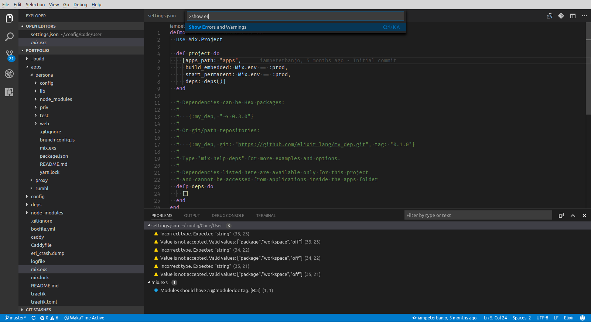

# Elixirlinter

Provides linting for Elixir files using [Credo](https://github.com/rrrene/credo) for [Visual Studio Code](https://code.visualstudio.com/)

## Features

* Error warning indicator under text
* Tooltips with lint message
* Configurable lint severity levels

## Requirements

[Credo](https://github.com/rrrene/credo)

## Extension Settings

- `"elixirLinter.useStrict": [true | false]`
- `"elixirLinter.defaultSeverity": [number]`
- `"elixirLinter.consistencySeverity": [number]`
- `"elixirLinter.designSeverity": [number]`
- `"elixirLinter.refactoringSeverity": [number]`
- `"elixirLinter.readabilitySeverity": [number]`
- `"elixirLinter.warningsSeverity": [number]`

### Linting

Lint messages appear in the format "Message [Category:Severity level]"

### Severity levels (settings.json)
* 1 = Warning (default). These appear underlined and in errors and warnings list.
* 2 = Information. These appear underlined and in errors and warnings list.
* 3 = Hint. These appear in errors and warnings list only.

### Categories
* Consistency [C]
* Readability [R]
* Refactoring Opportunities [F]
* Software Design [D]
* Warnings [W]

## [Changelog](CHANGELOG.md)

## [Contributing](CONTRIBUTING.md)

## Development

* Getting started: `npm install` then `npm run test:watch`

## Credits

* [vscode-credo](https://github.com/joshjg/vscode-credo)
* [yeoman](http://yeoman.io/)
* [vscode-extension-tutorial](https://github.com/hoovercj/vscode-extension-tutorial)

## [Authors](AUTHORS.md)
