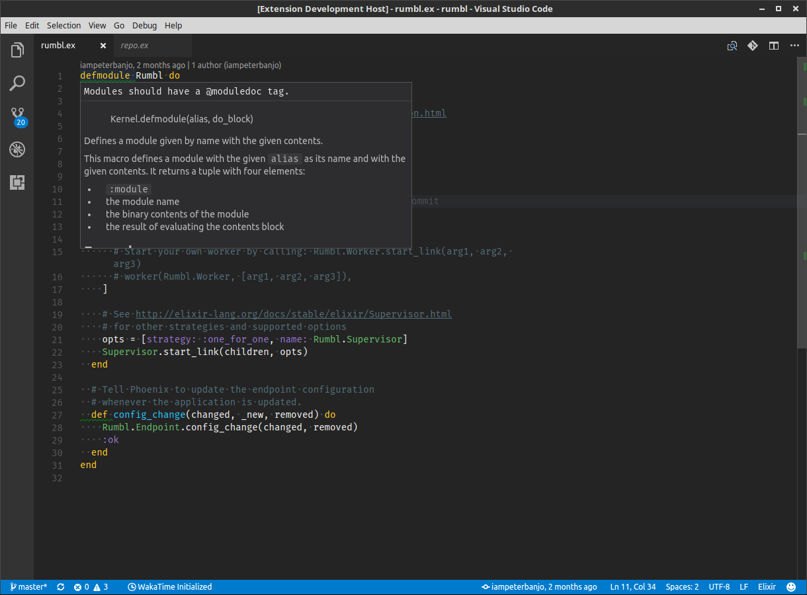

# Elixirlinter

Provides linting for Elixir files using [Credo](https://github.com/rrrene/credo) for [Visual Studio Code](https://code.visualstudio.com/)

## Features

* Error warning indicator under text
* Tooltips with lint message

## Requirements

[Credo](https://github.com/rrrene/credo)

## Extension Settings

None
## Release Notes

### 0.1.0

* Initial release
* Error warnings and tooltips

## Contributing

Contributions welcome - please raise an issue or open a pull request

## Development

* Getting started: `npm install` then `npm run dev`
* Tests: `npm test` or `npm run test:watch`

## Credits

* [vscode-credo](https://github.com/joshjg/vscode-credo)
* [yeoman](http://yeoman.io/)
* [vscode-extension-tutorial](https://github.com/hoovercj/vscode-extension-tutorial)
